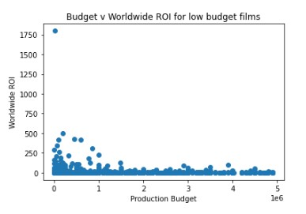
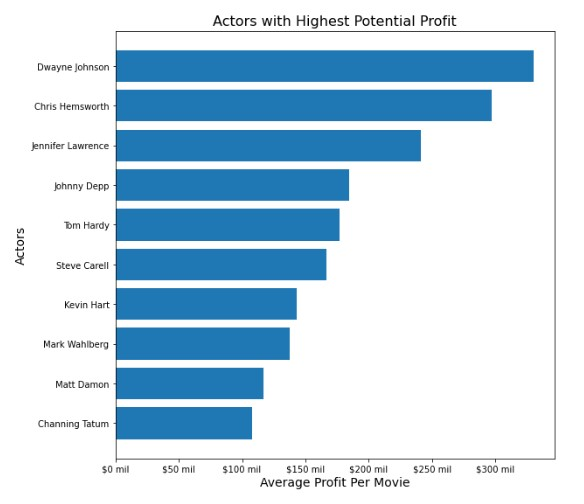
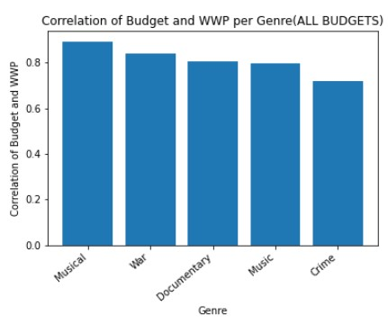

# Microsoft Movie Project

**Authors**: Mitch Allison, Matt Rubic, Brenda De Leon

## Overview

A new fictitous Microsoft movie studio is formed. They have asked us to give at least 3 actionable steps to lead to the creation of a financially successful movie.
We've cleaned and analyzed data sets from TheNumbers and IMDB to find the strongest actionable steps to create a successful movie.

## Business Problem

We are looking to find at least 3 actionable steps to insure the greatest chance for a new movie's financial success. The questions to be answered are:
* What budget provides the greatest profit or ROI?
* What actors/actresses/directors lead to the greatest profit?
* What genres lead to the greatest profit at differing movie budgets?
* What is the best time of year to release a movie?

***
Notes:
* A new movie studio has no relationship with talent or catalogue of movies. We need to use our initial seed money intelligently, to foster future success.
* We picked these questions to answer after looking at the cleaned data and spotting certain trends.
* A new movie is expensive. We need to analyze data from the past decade of movies to maximize profit given a certain budget.
Starting with a flop as a new studio is likely difficult to recover from without additional investment.
***

## Data

We used data from the IMDB SQL database to reference talent and movies. We used data from TheNumbers csv to find financial data for movies.
Both datasets required some cleaning, espescially in order to join them and find trends between movies features and their financial data.

***
Notes:
* This data is publicly available, from IMDB and TheNumbers. They relate to the questions as they are comprehensive sources for data concerning movies.
* The data represents movies and their features. This data includes variables such as actors, directors, movies, budget, and grossing.
* To answer our business questions, we needed to know each movie's financial information, how that movie was classified, when it was released,
and who was associated with that movie.
* We intend to use the correlations of budget to worldwide profit to find the movies that are most likely to see a good return on investment(budget).
***

## Methods

We first cleaned the data. Many movies share genres so we needed to create an additional feature of 'movie name' + 'year released'. We could then join the movies
on these columns.
After joining the data, we were able to find relationships between genre, actors/directors, budget and release date versus worldwide profit.

***
Notes:
* This data required some standard cleaning to use, such as cleaning up dollar amounts from strings to integers and excluding duplicates.
For our inital modeling we used standard methods of graphing data, and then breaking up data by actors/directors or genres.
* This approach is appropriate considering the size of the datasets. Our business problem did not have specific asks,
only to provide the best advice that we can find with these datasets.
***

## Results

We found the following answers to the business questions:
* Profits generally increase as budgets increase. ROI possibility is much greater for smaller budgets(up to 100x) versus larger budgets(up to 15x).
* Top actors/actresses/directors command greater profits.
* For an unknown budget, musicals have the best correlation of budget to profits. For small/medium/large budgets, we recommend music/history/war genres accordingly.
* June to July and November to December have the greatest average movie profits.

***
Notes:
* We found these results in our initial data analysis. We interpret these results as having a strong impact on a movie's profit.
* We are fairly confident in our results, due to the size of the data and methods used. Although some outliers were still used in our conclusions,
we have to include these outliers as they give us good data points to compare to other similar movies.
***

### Budget vs ROI (Low Budget)


### Actor vs Profit


### Genre vs Profit


### Release Day vs Profit


## Conclusions

We were able to find some strong commonalites between movies that do well, given a certain budget. We were also able to pinpoint optimal times to
release a movie, and how actors/directors contribute to a movie's success.
We were a bit limited by the datasets, as IMDB only provided data for movies from 2010 to 2018. This was 4 years ago, and so the data may be
slightly outdated. Considering the span of movies covered, we still have good faith in this dataset and the conclusions we reached with the dataset.

***
Notes:
* We would recommend the business follow our tips to maximize profit in a new movie studio. Although some of these tips may conflict
(Dwayne Johnson in a musical?), following our general guidelines will help to maximize profit and reduce investment risk.
* This analysis may not fully solve the business problem as it is a multifaceted problem. If the studio is looking for a higher-risk investment,
we did not account for that. Our goal was to provide the most sound suggestion for profit maximization with minimal risk.
* In the future, we could use more recent data to improve our observations. We would also like to look into promotional budgets to see how those may
have affected the profit of the movie. It would also be interesting to see how to optimize a movie for various audiences with additional data.
***

## For More Information

Please review our full analysis in [our Jupyter Notebook](./MS_Movie_Data_Analysis.ipynb) or our [presentation](./MS\ Movie\ Conclusions\ Presentation\ -\ RFC\ Dandelions.pdf).

For any additional questions, please contact:
Mitch Allison
Email: mitch.allison2@gmail.com
GitHub: @mitchallison2
LinkedIn: linkedin.com/in/mitch-allison2

Matt Rubic
Email: rubicmatt@gmail.com
GitHub: @mattrubic
LinkedIn: linkedin.com/in/matt_rubic_

Brenda De Leon
Email: brendardeleon@gmail.com
GitHub: @brdeleon
LinkedIn: linkedin.com/in/brenda-de-leon


## Repository Structure

```
├── README.md                           <- The top-level README for reviewers of this project
├── MS_Movie_Data_Analysis.ipynb        <- Narrative documentation of analysis in Jupyter notebook
├── MS Movie Conclusions Presentation - RFC Dandelions.pdf         <- PDF version of project presentation
├── data                                <- Both sourced externally and generated from code
└── images                              <- Both sourced externally and generated from code
└── brenda_actor_relationship_analysis.ipynb                       <- EDA of actor/profit relationship
└── brendas_datacleaning_actor_relationship .ipynb                 <- Cleaning of actor/profit relationship data
└── brendas-dsc-phase1-project.ipynb    <- Graphs/Analysis of actor/profit relationship
└── Matt's_Workbook.ipynb               <- TheNumbers data cleaning, EDA, analysis of budget vs profit/roi and release day vs profit
└── MitchA_IMDB_Cleaning_and_Analysis.ipynb                        <- Cleaning, EDA of IMDB data
└── MitchA_GenreCharts.ipynb            <- Graphs/Analysis of genre correlations between budget/profit
```
